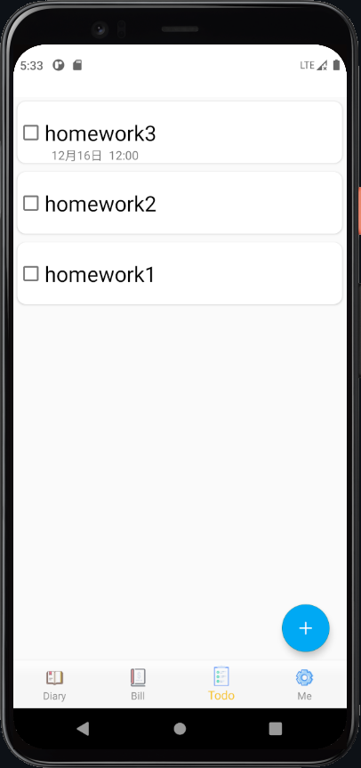

[🇨🇳 中文](README.md)

# Diary In UESTC

**University of Electronic Science and Technology - Software Engineering Project**

CDE Notes is a simple yet feature-rich diary and accounting application.
It boasts numerous categories such as accounting, diary writing, to-do lists, and personal information display.
CDE Notes can help streamline your work, remind you of tasks, efficiently record your daily observations, inspirations, thoughts, and interactions. A one-stop solution to jot down to-dos, create ledgers, and express your feelings.

【Features】  
【Accounting】——Log every expense and income, ensuring a trackable financial record.  
【Ledger Categories】——Different types of entries are represented by distinct symbols for clarity.  
【Unique Input Methods】——Choose from sliding to select amounts, picking integer labels, direct input, and more.  
【Entry Notes】——Each transaction can have a personalized note for detailed accounting.  
【To-Dos】——Input crucial reminders to avoid potential oversights.  
【Diary】——Capture every moment in life, preserving memories for the future.  
【Diary Themes】——Offering a variety of backgrounds to choose for your diary. Match your mood with the perfect backdrop. CDE Notes helps design your favorite diary style.  
【Word Count】——Keep track of your diary's length for the day.  
【Share Diary】——Instantly share your diary entries with friends, letting them in on your daily experiences.  
【Update Personal Info】——Choose your avatar, username, and bio, creating a unique user ID just for you.

### Screenshot 
[comment]: <> ()

[For more information]( https://yingchenxing.github.io/categories/%E6%88%90%E7%94%B5%E5%BE%AE%E8%AE%B0/)
